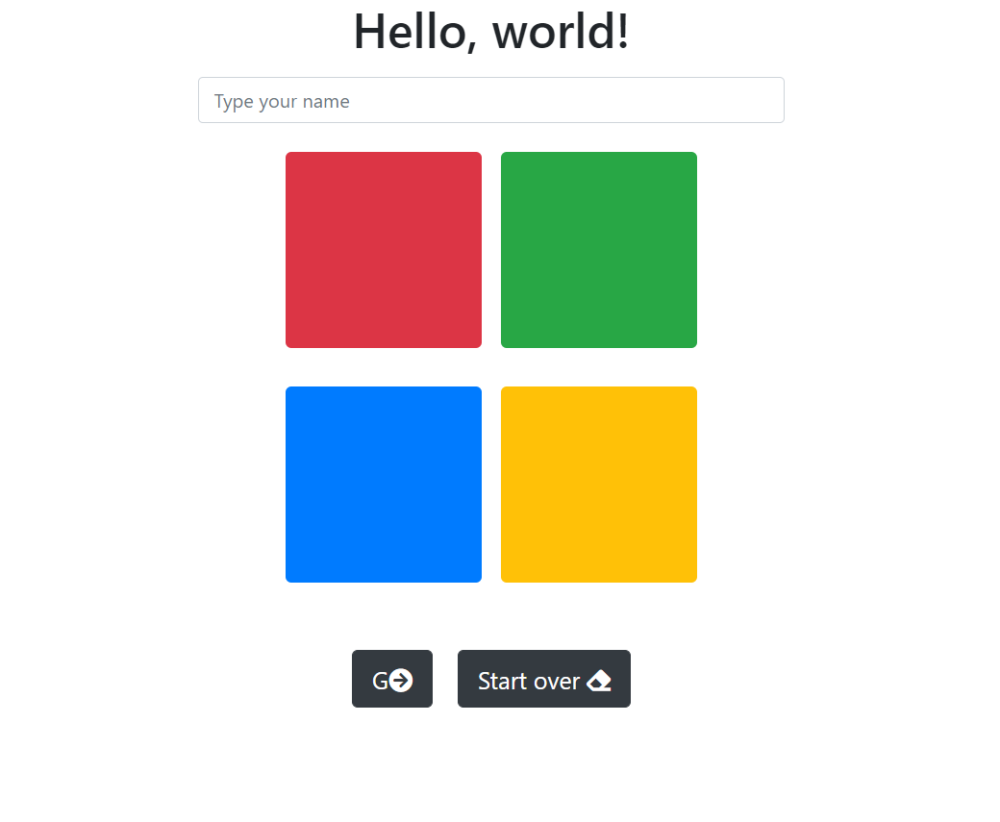
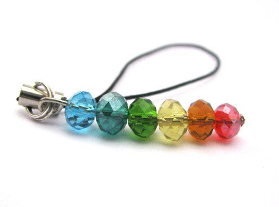

# Login4Littles

## Table of Contents

[Project Description](#description)
 
[Installation Guide](#installation-guide)

[Usage Iinformation](#usage-information)

[Contribution Guidelines](#contribution-guidelines)

[Testing Instructions](#testing-instructions)

[License Information](#license-information)

[Questions](#questions)

## Description

A javascript login interface for the littlest of users

Even small children can learn to follow a color pattern, and making a beaded dangle or bracelet, displaying the pattern in some way, or helping them memorize it can introduce kids to passwords and privacy on devices. I envision this inside a basic login function where the child's grownup can do a group login, and kids can then log into their profile on a group page when they need to. 

## Installation Guide

npm install

## Usage Information

## Contribution Guidelines

Feel free to contact me via github or email.

## Testing Instructions

n/a

## License Information

Notice: This application is covered under the MIT license.

 [License: MIT](https://opensource.org/licenses/MIT)

## Questions

If you have any questions, please feel free to reach out via one of the following avenues.

#### Contact info

[My GitHub](https://github.com/maggiemaywilder)

[My email](mailto:maggiemaywilder@gmail.com)